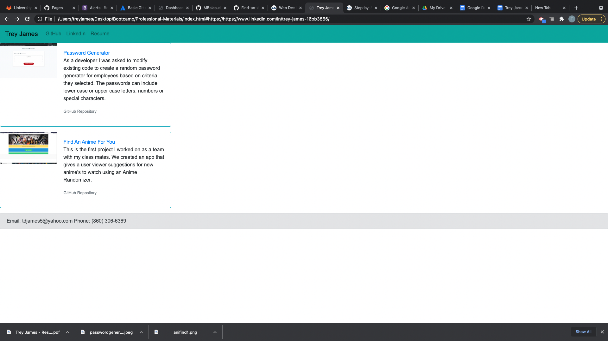

# Professional-Materials
Profile page with links, to Resume, LinkedIn Profile, Github Profile

## Table of Contents
-[General Info](#General-Info)
-[Version History](#version-history)
-[Screenshots](#screenshots)
-[Technologies Used](#technologies-used)
-[Location](#location)
-[Contact](#contact)

## General Info
As a developer I was asked to create an updated portfolio page including the following criteria:

1. Display your full name, email, and phone number

2. Have links to your GitHub profile and LinkedIn profile

3. Have a link to a downloadable PDF of your resume

4. Display at least 2 examples of student work from either deployed projects or homeworks. For each project, make sure you have the following:

    * Project title

    * Link to the deployed version

    * Link to the GitHub repository

    * Screenshot of the deployed application

5. Have a polished, mobile-responsive user interface.

## Version History
Version 1
Date Modified: 5/15/2021
Modified by: Trey James

## Screenshots

    
## Technologies Used
Visual Stude Code
HTML
CSS
Bootstrap

## Location
View our website here: https://tdjames20.github.io/Professional-Materials/

## Contact 
Trey James - [Github] (https://github.com/tdjames20) Email: [Trey](mailto:tdjames5@yahoo.com)